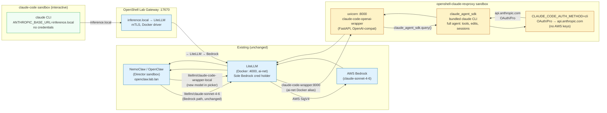

# Claude Code Wrapper — Deployed Architecture

**Status (2026-06-14): LIVE.** The architecture described here is deployed and verified
end-to-end. The `openshell-claude-revproxy` sandbox runs `claude-code-openai-wrapper`
(uvicorn on :8000); LiteLLM routes `claude-code-wrapper-local` requests to it via Docker
ai-net alias `claude-code-wrapper`; the OpenClaw director can invoke it as a model. A
real session was confirmed: an OpenClaw conversation with `litellm/claude-code-wrapper-local`
as the selected model executed correctly (Harbor Freight question returned the right answer,
model and routing logged in the JSONL session files).

**Auth path:** `CLAUDE_CODE_AUTH_METHOD=cli` (OAuth/Pro subscription) — **not** Bedrock.
AWS credentials are not in the wrapper sandbox. The sandbox connects to `api.anthropic.com`
directly using the OAuth token synced from the host via `bootstrap/sync-claude-credentials.sh`.

---

## What's Deployed

**Unchanged from original design (existing paths):**
- NemoClaw/OpenShell manages the OpenClaw director sandbox.
- LiteLLM is the sole holder of Bedrock credentials.
- `inference.local` path for interactive sandboxes (e.g., the `claude-code` sandbox).
- All existing director → LiteLLM → Bedrock paths unchanged.

**What was added (claude-code-wrapper-local):**
- `openshell-claude-revproxy` sandbox: a long-lived OpenShell container with `claude-code-openai-wrapper` running inside it, exposing the Claude Code agent as an OpenAI-compatible HTTP endpoint.
- The sandbox is connected to the Docker `ai-net` bridge with alias `claude-code-wrapper` so LiteLLM can reach it by name.
- Auth: `CLAUDE_CODE_AUTH_METHOD=cli` — the wrapper uses an existing OAuth session. No Bedrock or AWS credentials in the sandbox.
- LiteLLM gained three aliases (`claude-code-wrapper-local`, `claude-code-sonnet`, `claude-code/sonnet`) that all point to `http://claude-code-wrapper:8000/v1`.
- The OpenClaw director's `openclaw.json` was patched to include `claude-code-wrapper-local` as a model under the `litellm` provider, so it appears in the model picker.

---

## Architecture Diagram



---

## Data Flow: claude-code-wrapper-local Request

1. **Client request** — OpenClaw director (or any OpenAI-compatible client) sends
   `POST /v1/chat/completions` to LiteLLM with `model: claude-code-wrapper-local`.

2. **LiteLLM routing** — matches model name to the `openai` upstream pointing at
   `http://claude-code-wrapper:8000/v1`; forwards request with the internal API key
   (`claude-code-internal-revproxy-key-2026`).

3. **Wrapper receives** — `claude-code-openai-wrapper` (uvicorn, running inside the
   `openshell-claude-revproxy` sandbox) accepts the request. Rate limiting is disabled
   for this internal caller.

4. **SDK executes** — `claude_agent_sdk.query()` runs the bundled claude CLI as a
   subprocess. `CLAUDE_CODE_AUTH_METHOD=cli` means it reads OAuth credentials from
   `/root/.claude/.credentials.json` in the sandbox (synced from the host).

5. **Anthropic API** — the bundled claude binary calls `api.anthropic.com` directly
   (OAuth/Pro subscription). The sandbox policy allows this egress.

6. **Response path** — agent result → wrapper (assembled as OpenAI response) → LiteLLM → caller.

---

## Credential Boundaries

| Boundary | What lives there |
|---|---|
| LiteLLM container | AWS Bedrock credentials (sole holder) |
| `openshell-claude-revproxy` sandbox | Claude OAuth token at `/root/.claude/` (synced from host) |
| claude-code sandbox (interactive) | Nothing — inference via `inference.local` |
| OpenClaw director sandbox | Nothing — inference via LiteLLM |

No sandbox other than the revproxy sandbox holds OAuth credentials. The revproxy sandbox
holds no AWS keys. LiteLLM is the only entity with Bedrock access.

---

## Operational Notes

**Start / restart the wrapper:**
```bash
bootstrap/setup-claude-revproxy.sh
```

**Sync OAuth credentials after re-login:**
```bash
# On host first:
claude auth login
# Then:
bootstrap/sync-claude-credentials.sh
```

**Verify wrapper is live:**
```bash
_SB=$(docker ps --filter 'name=openshell-claude-revproxy-' --format '{{.Names}}' | head -1)
docker exec "$_SB" ss -tlnp | grep ':8000'
```

**Check a director session to confirm model routing:**
```bash
# Inside the director container, session files at:
# /sandbox/.openclaw/agents/main/sessions/<session-id>.jsonl
```

The sandbox must be re-connected to ai-net and the wrapper restarted after a sandbox
rebuild. The `setup-claude-revproxy.sh` script handles both idempotently.

**Related files:**
- `bootstrap/setup-claude-revproxy.sh` — wrapper setup
- `bootstrap/sync-claude-credentials.sh` — OAuth credential sync
- `litellm/config.yaml` — model routing entries
- `bootstrap/nemoclaw-director-probe.sh` — adds claude-code-wrapper-local to OpenClaw picker
- `docs/diagrams/claude-code-wrapper-data-flow.md` — detailed wrapper data flow
