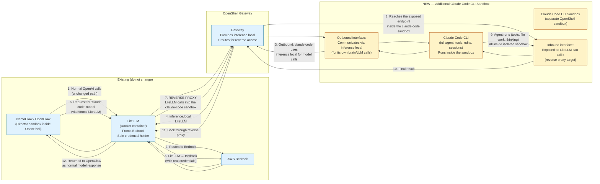

# Claude Code CLI Sandbox — Exact Desired Architecture (Confirmed)

**User clarification (verbatim intent):**

> Right now we have nemoclaw/openshell. openshell has openclaw running in it (which makes it nemoclaw). we have a litellm container running in docker which is fronting bedrock. I don't want this to change. I want to ADD an additional claude code cli in openshell communicating in inference.local and then ALSO have litellm be able to communicate with that openshell container and reverse proxy with nemoclaw/openclaw.

This document records the precise understanding and the corresponding data flow diagrams.

## Confirmed Understanding (matches user's words exactly)

**Unchanged / must stay exactly as-is:**
- NemoClaw setup with OpenShell.
- Inside OpenShell there is an OpenClaw instance (the "director") — this is what makes the stack "NemoClaw".
- LiteLLM runs as a Docker container.
- LiteLLM is the front for Bedrock.
- All existing inference paths for OpenClaw / NemoClaw go through LiteLLM.
- The `inference.local` mechanism (via OpenShell gateway) exists for sandboxes to consume inference without holding credentials.

**What to ADD (new thing only):**
- One **additional** OpenShell sandbox (separate from the director).
- Inside that new sandbox: a **Claude Code CLI** (the full agent, capable of tools, file work, long sessions, etc.).
- This additional Claude Code CLI sandbox **communicates outbound on `inference.local`** for its own LLM "brain" calls (exactly like other agent sandboxes are intended to do). It does **not** hold direct Bedrock or Anthropic keys.
- **Also**: LiteLLM must be able to initiate communication **into** that OpenShell container (reverse direction).
- LiteLLM acts as the reverse proxy / router so that requests coming from NemoClaw/OpenClaw (the director) for a "claude code" model can be sent to the claude-code sandbox.
- Result: From the perspective of OpenClaw/NemoClaw, the powerful claude-code agent (running safely isolated in its own OpenShell sandbox) appears as just another model served by the existing LiteLLM.

In short:
- The new sandbox is a **consumer** of `inference.local` (for the agent's intelligence).
- The new sandbox is also a **provider** that LiteLLM can call (so OpenClaw can use the agent as a model).
- Nothing about the existing director → LiteLLM → Bedrock path or the main OpenClaw instance changes.

This is the "claude-code-revproxy" work: making the claude code sandbox reachable in the reverse direction from LiteLLM while it continues to use the normal outbound inference path.

---

## Mermaid Diagram — High-Level Architecture

---

## Detailed Numbered Data Flow (Matches User's Description)

**Outbound (the claude code CLI sandbox talking to inference.local):**

1. The Claude Code CLI (inside its dedicated OpenShell sandbox) needs to call an LLM for its reasoning / next step.
2. It is configured to use `inference.local` (the standard mechanism provided by the OpenShell gateway for sandboxes).
3. The gateway forwards `inference.local` to LiteLLM.
4. LiteLLM routes the call to Bedrock using the real credentials it holds.
5. Response comes back the same path: Bedrock → LiteLLM → gateway → `inference.local` → the Claude Code CLI inside the sandbox.

This is exactly "claude code cli in openshell communicating in inference.local". The sandbox holds no credentials.

**Reverse / Provider direction (what LiteLLM + NemoClaw gain):**

6. Something in OpenClaw / NemoClaw (or any client talking to LiteLLM) requests a model that has been configured in LiteLLM to be backed by the claude-code agent (e.g. `claude-code-sonnet`).
7. LiteLLM does **not** send this to Bedrock directly. Instead it reverse-proxies the request to the claude-code sandbox (via the gateway or direct container addressing on the bridge).
8. The request arrives at the exposed endpoint inside the claude-code sandbox. (This endpoint is provided by whatever makes the native claude CLI callable — typically the claude-code-openai-wrapper running persistently in that sandbox, or an equivalent shim.)
9. The Claude Code CLI agent runs its full loop (tools, Read/Write/Bash/Edit, multi-turn reasoning, etc.). All of this happens safely inside the isolated OpenShell sandbox (subject to the claude-code policy).
10. When the agent itself needs LLM calls during its work, it uses the outbound `inference.local` path (steps 3-5 above).
11. When the agent finishes the task, the result is returned through the inbound path.
12. LiteLLM returns it to the original OpenClaw caller as a normal model response.

From OpenClaw/NemoClaw's point of view: it just asked LiteLLM for a model. The fact that the "model" is actually a full isolated claude-code agent running in another OpenShell sandbox is hidden behind LiteLLM.

**Credential & isolation boundaries (preserved):**
- Only LiteLLM holds the real Bedrock credentials.
- The claude-code sandbox only ever talks outbound via the gateway (`inference.local`). No keys live inside it.
- All the dangerous / powerful agent work (file system changes, shell execution) is contained inside the dedicated OpenShell sandbox with its policy.
- The director OpenClaw instance and the new claude-code sandbox are separate OpenShell sandboxes.

---

## Why the "reverse proxy with nemoclaw/openclaw" part matters

NemoClaw/OpenClaw (the director) already talks to LiteLLM for all its models. By making LiteLLM able to reach into the claude-code sandbox and treat the agent there as a model implementation, we get the full power of claude code (with its tools and long-horizon behavior) available to the rest of the system **without** changing how OpenClaw or the director are configured.

This is why the user wants **both** directions active for the new sandbox:
- Outbound on `inference.local` (so the agent has a brain without holding keys).
- Inbound reachability from LiteLLM (so OpenClaw can use the agent).

---

## Next Practical Implications (for implementation)

- We will need a persistent service inside the claude-code sandbox that can accept the incoming requests from LiteLLM (this is where the claude-code-openai-wrapper from the earlier discussion fits naturally — it turns the claude CLI into an OpenAI-compatible HTTP endpoint).
- The OpenShell gateway (or Docker networking + known container addressing) must support the "LiteLLM reaches into this named sandbox" direction in addition to the usual outbound `inference.local`.
- LiteLLM `config.yaml` will gain a new model entry that points at the address of the service running inside the claude-code sandbox (instead of a bedrock/ model).
- The existing director probe / openclaw.json / "litellm provider only" rule stays 100% unchanged.
- We can (and should) continue to support the pure native `claude` TUI / `-p` usage inside sandboxes via `inference.local` for interactive or direct scripting cases.

This matches the user's stated desire precisely.

---

**Files created for this clarification:**
- This document: `docs/diagrams/claude-code-agent-sandbox-flow.md`
- Previous detailed version (with more wrapper focus): `docs/diagrams/claude-code-wrapper-data-flow.md`

If the diagrams or the confirmation above do not yet match what you have in your head, reply with the exact adjustment and I will redraw immediately (new Mermaid + new generated image). No assumptions — only what you just described.