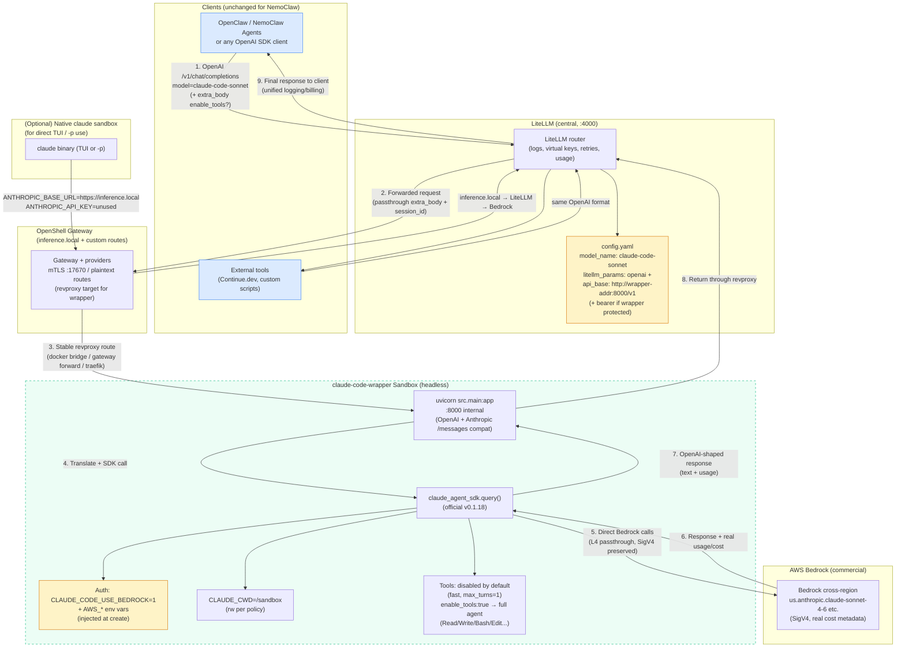

# Claude Code OpenAI Wrapper — Envisioned Data Flow

This document captures the proposed architecture for exposing a full Claude Code agent (running inside an isolated OpenShell sandbox) as a first-class model behind the existing central LiteLLM proxy.

**Core goal**: Add powerful agentic "claude-code" behavior (tools, long sessions, file editing in a safe workspace) as just another model name under the `litellm` provider. Nothing changes in NemoClaw / OpenClaw configuration or the director probe. All credentials and routing stay unified at LiteLLM + Bedrock.

---

## Generated Visual Diagram

A detailed architecture diagram was generated for this flow:

**Image path**: `/home/debian/.grok/sessions/%2Fhome%2Fdebian%2Fhome-lab/019ec751-4c45-77a0-96f0-acb62f1813a4/images/1.jpg`

(The diagram shows clients → LiteLLM → revproxied wrapper in sandbox → claude_agent_sdk → direct Bedrock, with the policy boundary, credential notes, native claude comparison path, and key labels for ports, auth, and tool enablement.)

---

## Mermaid Diagram (copy-paste ready)

---

## Step-by-Step Data Flow (Wrapper Path)

1. **Client request** (no change for most users)
   - OpenClaw agent, director, or any OpenAI-compatible client sends a normal `POST /v1/chat/completions` to LiteLLM (`http://localhost:4000` or the equivalent via the director).
   - Uses a model name registered in `litellm/config.yaml`, e.g. `claude-code-sonnet` or `claude-code/sonnet-4-6`.
   - Can include `extra_body: { "enable_tools": true, "session_id": "my-agent-session" }` for full agentic behavior + conversation continuity.
   - Authentication: the usual `Authorization: Bearer ${LITELLM_MASTER_KEY}`.

2. **LiteLLM routing**
   - Matches the model name to a custom `openai` upstream.
   - Forwards the entire request (headers, body, extra_body) to the wrapper's address (the critical "revproxy" link — see below).
   - LiteLLM can still apply its own limits, logging, spend tracking, fallbacks, etc.

3. **Reach the wrapper inside the sandbox (the revproxy piece)**
   - The wrapper runs persistently (`uvicorn ... --host 0.0.0.0 --port 8000`) inside a long-lived OpenShell sandbox (created e.g. via `osbox claude-code-wrapper --bedrock --headless` or equivalent `openshell sandbox create`).
   - Stable addressing options (work for the branch):
     - OpenShell gateway custom provider / route that forwards a known name (e.g. `claude-code.lab.lan` or `inference.local/claude-wrapper`) to the sandbox container's internal port.
     - Docker network reachability on the `ai-net` / `openshell-docker` bridge (sandbox container name or alias known to the LiteLLM container).
     - Sidecar forwarder (socat / nginx) or Traefik dynamic config that targets the sandbox.
   - If the wrapper has client protection enabled, LiteLLM supplies the static `API_KEY` as the bearer.

4. **Wrapper receives + translates**
   - Wrapper accepts the OpenAI (or Anthropic messages) request.
   - Applies its own rate limits (tune or disable for internal LiteLLM caller).
   - Converts messages to prompt + system.
   - Builds `ClaudeAgentOptions` (model, system_prompt, max_turns, allowed/disallowed_tools, permission_mode="bypassPermissions", resume/session).
   - If `enable_tools` present in the request → use the safe DEFAULT_ALLOWED_TOOLS set; otherwise tools fully disabled for speed.

5. **SDK executes inside the sandbox (the agentic work)**
   - `claude_agent_sdk.query(...)` runs.
   - Auth: The sandbox was created with Bedrock credentials injected (same keys as the main LiteLLM; osbox already handles sourcing `.secrets/bedrock.env`, `--env` injection, and pre-trust for `/sandbox`).
   - The SDK temporarily sets `CLAUDE_CODE_USE_BEDROCK=1` + AWS_* for the duration of the call (see `src/auth.py` + `src/claude_cli.py`).
   - All filesystem work happens in `CLAUDE_CWD=/sandbox` (read-write per the existing `claude-code.yaml` policy).
   - Network egress from the sandbox is strictly controlled by the same policy (Bedrock hosts + any anthropic for fallback/CLI; no arbitrary outbound).
   - Multi-turn agent loops (tool use, bash, edits, reads) execute entirely inside the isolated container.

6. **Backend inference (Bedrock direct)**
   - The SDK makes the actual model calls directly to Bedrock (cross-region inference profiles).
   - This is **not** routed back through LiteLLM for the "brain" — the wrapper is using the commercial Bedrock path.
   - Policy allows exactly the required hosts (`bedrock-runtime.*.amazonaws.com`, `bedrock.*.amazonaws.com`) with L4 passthrough so SigV4 signatures are preserved.
   - Real token counts and `total_cost_usd` come back in the SDK ResultMessage.

7–9. **Response path (reverse)**
   - SDK → wrapper (assembles OpenAI-shaped response, adds usage if requested).
   - Wrapper → LiteLLM (via the same revproxy route).
   - LiteLLM → original client.
   - Session state (if `session_id` used) is kept in the wrapper (in-memory, auto-expires after 1h).

---

## Contrast Path: Native `claude` inside sandbox (already supported)

For cases where you want the native Claude Code TUI or scripted `-p` calls *inside* a sandbox (not exposing the agent as an OpenAI model):

- Create with `osbox <name> --bedrock --headless` (or the ANTHROPIC_BASE_URL variant in the docs).
- Inside: `claude` binary (or `claude -p "..."`) respects `ANTHROPIC_BASE_URL=https://inference.local` + dummy key.
- `inference.local` is resolved by the OpenShell gateway → LiteLLM → Bedrock.
- This path is what the current `claude-code.yaml` policy + `osbox` + `litellm-proxy.md` were primarily designed for.
- The wrapper path is the "reverse": instead of the agent calling a proxied model, the *agent itself* becomes the model that outer clients call.

Both can coexist.

---

## Key Properties Preserved / Achieved

- **Single credential boundary**: Only LiteLLM (and the injected Bedrock env into the specific wrapper sandbox) ever see the real AWS keys. OpenClaw director and most clients see only the LITELLM_MASTER_KEY.
- **Nothing changes in nemoclaw**: The director probe and `openclaw.json` continue to list only the `litellm` provider. You just add the new model alias in the *central* `litellm/config.yaml`.
- **Isolation**: Full OpenShell policy + container boundaries. The agent can only touch what the policy + mounted workdir allow. No host filesystem escape.
- **Unified billing/logging**: All usage (normal models + claude-code agent sessions) appears in the same LiteLLM layer.
- **Limits impact (June 15, 2026 change)**: Using the Bedrock auth path inside the wrapper sandbox makes this completely unaffected by the new Agent SDK monthly credit system (which targets consumer subscription + CLI auth paths). This is commercial Bedrock billing.
- **Fast vs powerful**: Default requests are cheap/fast (tools off). Full coding agent power on demand via `enable_tools`.

---

## Open Items for the `claude-code-revproxy` Branch

- Stable, discoverable address for the wrapper port (the revproxy mechanism).
- Update `litellm/config.yaml` with one or more `claude-code-*` model entries (and any passthrough config for extra_body).
- Optional: small enhancement to `osbox` for "wrapper mode" (pre-install the wrapper code or run the server as entrypoint, set rate limits high, generate a static API key).
- Docs updates (point to this diagram).
- End-to-end test: simple prompt, then a tool-using edit task, then multi-turn via session_id.
- Optional: surface `claude-code-sonnet` (and opus/haiku) aliases in any UI pickers.

This architecture reuses almost everything already built (policy, osbox, gateway, LiteLLM as hub, Bedrock injection) while cleanly adding the "agent as a model" capability via the upstream wrapper project.

Let me know if you want variations (e.g. wrapper also calling back through LiteLLM, multiple wrapper sandboxes, MCP integration notes, etc.) or if I should generate additional diagrams (sequence diagram, component view, etc.).